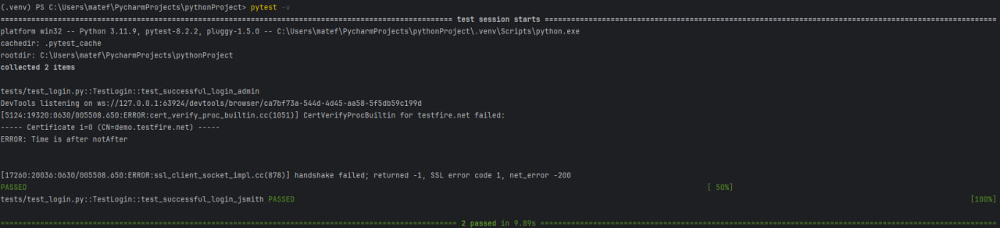
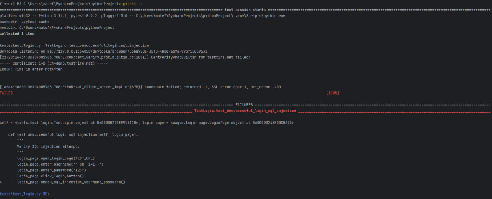
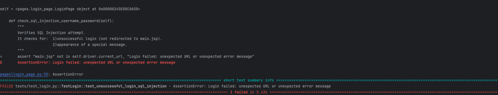

# Login Test Automation

This project contains automated tests for a login page, focusing on functionality and security aspects.

## Getting Started

1. **Install Python:** Make sure you have Python installed on your computer.
2. **Install Selenium:** You can install it using pip: `pip install selenium`
3. **Install ChromeDriver:** You can install it using pip: `pip install webdriver-manager`
4. **Install pytest:** You can install it using pip: `pip install pytest`
5. **Run the tests:** Use the command `pytest -V` in your terminal

## Project Structure

- **tests:** This folder contains the test files.
  - `test_login.py`: Tests for login functionality and security.
- **pages:** This folder contains page objects.
  - `base_page.py`: Base class for all page objects.
  - `login_page.py`: Page object for the login page. 
- **locators:** This folder contains element locators. 
  - `login_page_locators.py`: Locators for the login page.
- **conftest.py:** This file contains pytest fixtures.

## Tests

This project includes tests for:

- **Successful login:** Verifying login with valid credentials.
  
- **Potential SQL injection vulnerabilities:**
  - Attempting SQL injection through the username field. 
  
  
  